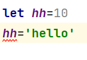

###
* **TS类型声明**
  * ts可以编译成任意版本的js文件(ES3，ES5，ES6都可以)
  * a:number, b:number-给参数加上类型声明，表示我希望sum函数的两个参数类型都是数字类型
  * function sum(a:number, b:number):number-括号后面的number表示希望函数返回值的类型是数字类型
    * 
  
* **TS中类型(1)**
  * 可以直接使用字面量进行类型声明
    * ```
      let a:10
      a=10
      ```
  * 可以使用 | 来连接多个类型(联合类型)
    * ```
      let b:"male" | "female"
      b="male"
      b="female"```
    * ```
      let c:boolean | string
      c=true
      c="hello"```  
  * any表示的是任意类型，一个变量类型设置为any后相当于对该变量关闭了TS的类型检测，所以使用TS时，不到万不得已，不建议使用any
    * 声明变量如果不指定类型，则TS解析器会自动判断变量的类型为any(隐式的any)
      * 
    * ```
      d=10
      d="hello"
      d=false
      ```
  * unknown 表示未知类型的值，可以设置任意类型的变量
    * ```
      let e:unknown
      e=10
      e="hello"
      e=true
      let s:string
      // d的类型是any，它可以赋值给任意变量
      // s=d
      ```
    * 但不可以把设置为unknown的变量赋值给其他类型的变量
      * ```
        e="hello"
        //unknown实际上就是一个类型安全的any，把unkmown类型的变量赋值给其他变量就会报错
        s=e
        ```
    * 类型断言，可以用来告诉解析器变量的实际类型
      * 语法：
        * 变量 as 类型
        * <类型>变量
        * eg:```s=e as string 
                s=<string>e```
  * void 表示空，以函数为例，就表示没有返回值的函数，如果return后面写了返回值就会报错
    * 可以不写，可以写undefined(虽然这是有病行为)，也可以写null
    * 
    * 如果写了返回值的类型函数的类型便是什么类型
      * 
    * 如果函数里啥也没写，那就会自动判断为void
      * 
    * 简单的例子
      * ```
        function fn(num) {
          if(num>0){
          return false
          }else{
          return 234
          }
        }
        ```
  * never 表示永远不会反悔结果，就是什么都没有，里面连undefined都别写
    * 不同于空，它是压根就是没有，它的用途就是用来报错的，用的少
    * ```
      function fn2():never {
        throw new Error('报错啦！！')
      }

      ```

* **TS中类型(2)**
  * object 表示一个js对象
    * 
    * 
      * 如果赋值时没有写某个属性名和值时，可以在没写的对象的属性后面加 ? ，表示某个没写的属性是可选的，可有可无
        * ```
          let b:{name:string,age?:number}
          b={name:"Luke",age:24}
          ```
    * 定义对象的结构
      * 设置对象c内有且只有一个属性就是name，不能出现name以外的任何属性
      * [propName:string]:any  表示任意类型的属性，如果]后面是string，就表示属性名后面必须是字符串类型的属性值
        * ```
          let c:{name:string,[propName:string]:any}
          c={name:"Artem",age:29,gender:"male"}
          ```
    * 设置函数结构的类型声明：
      * 语法：(形参:类型,形参:类型,...)=>返回值
      * 表示希望d是一个函数，有两个参数(a和b)，且两个参数的类型都是number类型，并返回值也是number
        * ```let d:(a: number,b:number)=>number```
      * 要注意的是定义了几个参数，后面就写几个参数，不能多写或少写，当参数类型不一致时，就会报错
        * 
    * 数组的声明类型：
      * 1. 类型[]
        * ```
          //string[] 表示字符串数组，希望e是个数组，里头装的都是字符串类型
          let e:string[]
          e=['a','s','g',]
          //:number[] 表示数值数组，希望f是个数组，里头装的都是数字类型
          let f:number[]
          ```
      * 2. Array<类型>
        * ```
          //和let f 是一个意思 :Array<number> 表示数值数组，希望g是个数组，里头装的都是数字类型
          let g:Array<number>
          g=[1,4,5,8]
          //不想限制那就设置为any，但是不建议，尽量明确属性的值类型
          let q:Array<any>
          q=[1,2,'hhhhh',true]
          ```
    * tuple 元祖，就是设置固定长度的数组，不可多，不可少，也不可能写错
      * 语法：[类型,类型,类型,类型]
      * 错误示范
        * [错误示范1](images/元祖.PNG)
        * [错误示范2](images/元祖2.PNG)
        * [错误示范3](images/元祖3.PNG)
    * enum 枚举-在多个值之间进行选择时，适合使用枚举
      * ```
        枚举一个类型，叫Gender，Gender里有两个值，male和female
        enum Gender{
          Male,
          Female
        }
        let s:{name:string,gender:Gender}
        s={
          name:'Vilhelm',
          //'男'/'male' 为了在数据库中占用的容量小，且属性名的值在一定范围内的，就设置为数值类型
          gender:Gender.Male
        }
        console.log(s.gender===Gender.Male)  //true
        ```
   * 补充：
      * | 或
        * ```
          表示k的类型是string或number
          let k:string|number
          
          ```
      * & 表示同时(且、与)
        * 例举有病行为:
          ```
          //表示r的类型是string且number
          let r:string&number ```
        * 正常行为：
          * ```
            let z:{name:string}&{age:number}
            z={name:"Marius",age:21}```
      * 类型的别名，主要用来简化类型的使用
        * 
        * 

* **TS编译选项(1)**
  * 自动编译文件
    * 编译文件时，使用 -w 指令后，TS编译器会自动监视文件的变化，并在文件发生变化时对文件进行重新编译。
      * ```tsc xxx.ts -w```
  * 自动编译整个项目
    * 如果直接使用tsc指令，则可以自动将当前项目下的所有ts文件编译为js文件
    *但是能直接使用tsc命令的前提时，要先在项目根目录下创建一个ts的配置文件tsconfig.json
    * tsconfig.json是一个JSON文件，添加配置文件后，只需tsc命令即可完成对整个项目的编译
    * 项目配置：
      * include：用来指定哪些ts文件需要被编译
        * ```"include":["./src/**/*"]```
          * 所有src目录下的文件都会被编译
      * exclude:不需要被编译的文件目录
        * 默认值：["node_modules", "bower_components", "jspm_packages"]
          * 有默认值的情况下，exclude可以不设置
        * ```"exclude": ["./src/hello/**/*"]```
          * src下hello目录下的文件都不会被编译
        * 路径：** 表示任意目录；* 表示任意文件
      * extends:定义被继承的配置文件
        * ```"extends": "./configs/base"```
        * 当配置文件特别复杂，又不想重复写，就可以把config目录下base.json中的所有配置信息合并到tsconfig.json文件中
      * files:指定被编译文件的列表，只有需要编译的文件少时才会用到
  
* **TS编译选项(2)**
  * compilerOptions
    * target  用来指定ts被编译为的ES版本
      * 可选值：'es3','es5','es6','es2015','es2016','es2017','es2018','es2019','es2020'
    * module  指定要使用的模块化的规范
      * 可选值：'none', 'commonjs', 'amd', 'system', 'umd', 'es6','es2015', 'es2020', 'es2022', 'esnext', 'node16'
      * 一般值就是es2015
    * lib  用来指定项目中要使用的库
      * 可选值：贼多，就不列举了，大概包含es的各种版本
    * outDir 用来指定编译后文件所在的目录
      * 默认情况下，编译后的js文件会和ts文件位于相同的目录，设置outDir后可以改变编译后文件的位置，就是可以把编译后的js文件统一归拢到dist文件夹中
      * ```"outDir": "./dist"```
    * outFile  将代码合并为一个文件
      * 设置outFile后，所有的全局作用域中的代码会合并到同一个文件中
      * ```    "outFile": "./dist/app.js"```
      * 值得注意的是，全局作用域下的代码会合并到同一个文件中，但如果有模块化的代码/文件时，需要把module设置为amd或system才可以顺利合并
    * allowJS  ，默认是false，就是不编译
      * ```"allowJs": true```
      * 但是有需要编译js代码的情况，此时需要将值改成true，编译后即可在dist目录中找到编译后的js文件
    * checkJS  是否检查js代码是否符合语法规范，默认也是false
      * 在js文件中，先创建一个变量hh，并赋值数值类型，再赋值其他类型不会报错，但把checkJS的值修改为true，就可以对js代码进行检查
        * 
    * removeComments  是否删除注释，默认值为false，改为true后，再次编译文件注释内容不会出现在合并的文件中
    * noEmit  不生成编译后的文件，默认值为false
      * 用在不想使用ts的编译功能，指向检查一下语法，用的不多
    * noEmitOnError  有错误的情况下不进行编译，会直接报错，默认值为false，改为true，再编译就会报错
    * alwaysStrict  用来设置编译后的文件是否使用严格模式，默认false，改为true，就会自动启用严格模式
    * noImplicitAny  不允许隐式的any类型，默认false
      * 
        * 如上图所述，此时给参数加上类型就可以了
    * noImplicitThis  不允许不明确类型的this，默认false
      * 
        * 解决方案，在函数参数里定义this的类型，在此可以给this定义任意类型地值，any也行(我定了window)
    * strictNullChecks  严格检查空值，默认false
      * 
      * 解决方法：
        * ```
          let box1= document.getElementById('box1')
          方法1
          if(box1!==null) {
               box1.addEventListener('click', function () {
                   alert('hello')
               })
          }
          方法2
          box1?.addEventListener('click',function () {
          alert('hello')
          })
          ```
    * strict  所有严格检查的总开关
      * 如果是true，alwaysStrict到strictNullChecks的值默认都是true/false，也就可以不写
  
* **使用webpack打包ts代码**
  * 初始化项目
    * 进入项目根目录(part03)，执行命令npm init -y，创建package.json文件
  * 下载创建工具
    * 命令：```npm i -D webpack webpack-cli webpack-dev-server typescript ts-loader clean-webpack-plugin```
    * 共安装了7个包：
      * webpack：构建工具webpack 
      * webpack-cli：webpack的命令行工具
      * webpack-dev-server：webpack的开发服务器
      * typescript：ts编译器
      * ts-loader：ts加载器，用于在webpack中编译ts文件
      * html-webpack-plugin：webpack中html插件，用来自动创建html文件
      * clean-webpack-plugin：webpack中的清除插件，每次构建都会先清除目录
  * 配置webpack，在根目录下创建webpack的配置文件webpack.config.js
    * ```
      const path = require("path");
      module.exports = {
        optimization:{
          minimize: false // 关闭代码压缩，可选
        },      
        entry: "./src/index.ts",      
        devtool: "inline-source-map",      
        devServer: {
          contentBase: './dist'
        },      
        output: {
        path: path.resolve(__dirname, "dist"),
          filename: "bundle.js",
          environment: {
          arrowFunction: false // 关闭webpack的箭头函数，可选
          }
        },      
        resolve: {
          extensions: [".ts", ".js"]
        },      
        module: {
        rules: [
            {
              //test指定的是规则生效的文件
              //用ts-loader处理(编译)以ts结尾的文件
              test: /\.ts$/,
              use: {
                loader: "ts-loader",
                //要排除的文件
                exclude: /node_modules/    
              },
            }
          ]
        },      
        plugins: [
            new CleanWebpackPlugin(),
            new HtmlWebpackPlugin({
              title:'自定义title'
            }),
          ]
      }
      ```
  * 配置TS编译选项，在根目录下创建tsconfig.json，配置可以根据自己需要
    * ```
      {
        "compilerOptions": {
          "target": "ES2015",
          "module": "ES2015",
          "strict": true
        }
      }
      ```
  * 修改package.json配置
    * ```
      {
        "scripts": {
          "test": "echo \"Error: no test specified\" && exit 1",
          "build": "webpack",
          "start": "webpack serve --open chrome.exe"
        }
      }
      ```
  * 项目执行
    * 打包，在src下创建ts文件，并在并命令行执行npm run build或npm start对代码进行编译
  * Babel
    * 安装依赖包 npm i -D @babel/core @babel/preset-env babel-loader core-js
    * 共安装四个包：
      * @babel/core：babel的核心工具
      * @babel/preset-env：babel的预定义环境
      * @babel-loader：babel在webpack中的加载器
      * core-js：core-js用来使老版本的浏览器支持新版ES语法
    * 修改webpack.config.js配置文件
      * ```
        module: {
          rules: [
            {
              test: /\.ts$/,
              use: [
            {
            loader: "babel-loader",
            options:{
              presets: [
                [
                  "@babel/preset-env",
                    {
                      "targets":{
                        "chrome": "108",
                    },
                  "corejs":"3",
                  "useBuiltIns": "usage"
                     }
                ]
               ]
              }
            },
            {
               loader: "ts-loader",
             }
          ],
          exclude: /node_modules/
            }
          ]
        }
        ```
    * 如此，使用ts编译后的文件将会再次被babel处理，使代码可以在大部分浏览器直接使用，同时可以在配置选项的targets中指定兼容的浏览器版本
  
* **面向对象**
  * 面向对象的编程语言（oop）就是写程序/代码的时候，所有的操作都是通过对象去操作的
    * 在程序中对象被分为两个部分，数据和功能，以人为例，性别、年龄、身高、体重等属于数据，人可以说话、走路、吃饭、睡觉、打人，这些属于人的功能
      * 数据在对象中被称为属性， 功能就被称为方法
  * 类(class)，主要包含两个部分：属性和方法
    * 属性
      * 使用class关键字来定义一个类(Person)
      * ```
        Class Person{
          name="Artem";
          age=29
        }
        ```
      * 直接定义的属性是实例属性，需要通过对象的实例去访问。除了这些还可以修改属性的值，也就是说，成为类属性，甚至拥有读写功能
        * ```
          const per=new Person()
          per.name,per.age
          ```
        * ```
          console.log(per.name);  //Artem
          per.name = "Vilhelm";
          console.log(per.name);  //Vilhelm
          ```  
        * 但是代码如果变成```readonly name:string="Artem";```，下面就无法修改属性值，具备只读的属性，如下：
          * 
      * 使用static开头的属性是静态/类属性，无需创建对象，可以直接通过类访问。
        * ```Person.age```
        * 
        * 
    * 方法，相较于属性简单，直接写关键字就可以了，如下：
      * ```
        sayHello() {
          console.log("Tears of Themis");
        }
        ```
      * 想要调用sayHello()时，直接写的就表示是实例方法，需要创建实例对象(per)后再访问
        * ```per.sayHello()```
      * 但是如果加了static，```static sayHello() { console.log("Tears of Themis"); }```，就会变成类/静态方法，可以直接调用/访问，
        * ```Person.sayHello()```
      * 
    * 相同点：为实例属性/方法时，需要创建对象去访问(就是没加static的时候)；为类/静态属性/方法时，无需创建对象，直接访问调用即可
  * 构造函数
    * 使用constructor定义一个构造函数(注：在TS中只能有一个构造函数)
      * 一般一个类里面要创建多个对象，```const dog2=new Dog()```，就可以了。
      * 这样在Dog类里就可以创建不同的dog，此时最好的实践就是不给Dog类的两个属性赋值，只指定属性的类型，
      * 在创建新的对象(const dog2)后，每调用一次new Dog()，就相当于调用一次Dog类里面的构造函数(constructor)，
      * 这样属性(name&age)的值，可以通过向构造函数中传递参数(name:string,age:number)，赋值时，就不可以固定值(固定了就没啥意义了)，
      * 得把参数的值(name:string,age:number)赋值给属性```this.name=name; this.age=age```。然后在创建的新的对象中，传递参数(eg:const dog2=new Dog('修勾',1))，
      * 这样就可以以传递不同的参数值的方法，创建属性(name&age)值各不相同的对象('狗桑',3&'修勾',1)。以此方式，可以创建出不同类型的对象。
      * ```
        class Dog{
          name:string;
          age:number
          //constructor 被称为构造函数
          //构造函数会在对象创建时调用，就是调用new Dog()的时候
          constructor(name:string,age:number) {
              //在实例方法中，this表示当前的实例
              //在构造函数中，当前对象就是当前新建的那个对象
              //所以，在构造函数中，可以通过this向新建的对象中添加属性
              // console.log(this)
              this.name=name;
              this.age=age
          }
          bark(){
              // alert('汪汪汪')
              //在方法中可以通过this来表示当前调用方法的对象
              console.log(this)
              console.log(this.name);
              console.log(this.age);
          }
        }
        const dog=new Dog('狗桑',3)
        const dog2=new Dog('修勾',1)
        console.log(dog);
        console.log(dog2);
        dog.bark()
        dog2.bark()
        ```
    * 继承，子类继承父类时，必须调用父类的构造方法如果子类中也定义了构造方法
      * ```
        class Animal {
          name:string;
          age:number
          constructor(name:string,age:number) {
            this.name=name;
            this.age=age
          }
          sayHello(){
            console.log('你瞎喊什么！！')
          }
        }
        //使Dog类继承Animal类
        class Dog extends Animal {
          run(){
            console.log(`${this.name}你跑啥！！`)
          }
          sayHello() {
            console.log('汪汪汪')
          }
        }
        //定义一个表示猫的类
        //使Cat类继承Animal类
        class Cat extends Animal {
          sayHello() {
            console.log('喵喵喵')
          }
        }
        ```
      * 可以把父类的方法和属性原原本本的继承，还可以子类中直接添加子类独有的某些属性；修改父类属性才是重写
      * 优点：可以在不修改原来类的基础上，创建一个继承原来类的新的类，并进行扩展(添加新的属性和方法)
      * 如果在子类中添加了和父类相同的方法，则子类方法会覆盖掉父类的方法,这种子类覆盖掉父类方法的形式，我们称为方法重写
    * 

###总结
* a：是程序自动显示的，代码里不用敲
* TS的优点之一：类型声明不仅能用在变量身上，也可以用在参数和返回值身上
* 老师曰：不要嫌TS/unknown麻烦，遇到类型不确定的变量尽量能用unknown就用unknown，能不用any就尽量不用any，嫌麻烦别用TS
* TS编译器可以根据返回值的情况判断变量或函数的类型
* 中括号里的不是变量，你把他当成一个rule就行
* 老师曰：什么是面向对象？答：阿弥陀佛，一切皆是对象(废话，要不然你叫这名干啥)
* 面向对象的编程语言（oop）就是写程序/代码的时候，所有的操作都是通过对象去操作的
  * 在程序中对象被分为两个部分，数据和功能，以人为例，性别、年龄、身高、体重等属于数据，人可以说话、走路、吃饭、睡觉、打人，这些属于人的功能
    * 数据在对象中被称为属性， 功能就被称为方法
* readonly 开头的属性表示一个只读的属性，无法修改。
* this 表示的是当前对象
  * 在构造函数中(以上面的constructor为例)，this就是新创建的对象，就是dog2
  * 在实例方法中(以上面的bark()为例)，this就是谁调用bark()方法，谁就是this；this表示当前对象，如果dog.bark()（这个方法时通过dog对象调用的），此时this就是dog，也就是狗桑
    * ***前提是在实例方法的环境下，静态另说***
* 继承
  * 可以把父类的方法和属性原原本本的继承，还可以子类中直接添加子类独有的某些属性；修改父类属性才是重写
  * 优点：可以在不修改原来类的基础上，创建一个继承原来类的新的类，并进行扩展(添加新的属性和方法)
